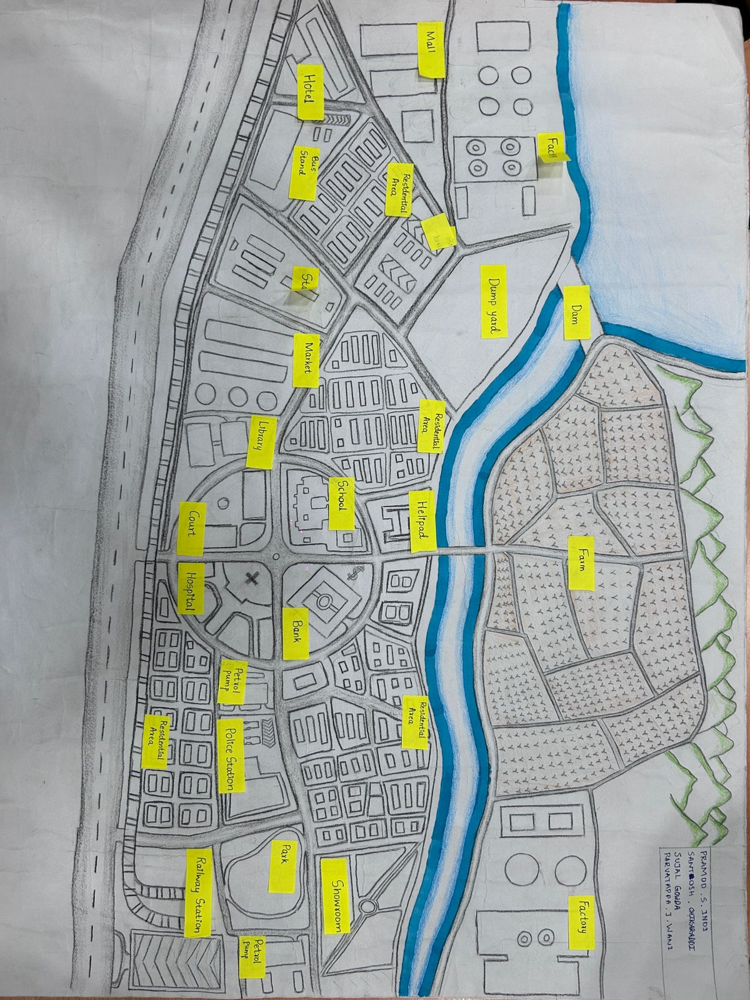

<!-- Compact & Enhanced Next‑Gen City Design Homepage -->
<!-- NOTE: Your full upgraded version with reduced spacing, vertical layout, advanced animations/effects -->

<!DOCTYPE html>
<html lang="en">
<head>
<meta charset="UTF-8">
<meta name="viewport" content="width=device-width, initial-scale=1.0">
<title>Next‑Gen City Design</title>
<link href="https://fonts.googleapis.com/css2?family=Poppins:wght@300;400;600;800&display=swap" rel="stylesheet">

</head>

<body>

<header>
  
CITY DESIGN

  <nav>
    <a href="#home">Home</a>
    <a href="#about">About</a>
    <a href="#city">City</a>
    <a href="#team">Team</a>
  </nav>
</header>

<section class="hero" id="home">
  <h1>Next‑Gen City Design</h1>
  
Compact, vertical, futuristic — powered by DAA algorithms.

</section>

<section class="section" id="about">
  <h2>🌆 About the Project</h2>
  

    This upgraded smart‑city model integrates <b>DAA algorithms</b> for traffic optimization,
    water distribution, emergency routing, and AI‑driven waste collection. Now redesigned in a
    compact vertical layout with advanced animations.
  

</section>

<section class="section" id="city">
  <h2>🏙️ City Layout (Vertical)</h2>
  
The city map is preserved exactly as requested — placed in a taller vertical frame.

  
</section>

<section class="section" id="team">
  <h2>👥 Team Members</h2>
  

    

      <h3>Pramod S Indi</h3>
      
Smart Traffic Optimization

      <a href="pramod.html" class="team-box">Open</a>
    

    

      <h3>Parvatappa J Wani</h3>
      
Smart Water System

      <a href="parvatappa.html" class="team-box">Open</a>
    

    

      <h3>Sujal S Gowda</h3>
      
Emergency Routing

      <a href="sujal.html" class="team-box">Open</a>
    

    

      <h3>Santosh Chikaraddi</h3>
      
AI Waste Collection

      <a href="santosh.html" class="team-box">Open</a>
    

  

</section>

<footer>© 2025 Next‑Gen City Design — DAA Project</footer>

</body>
</html>
